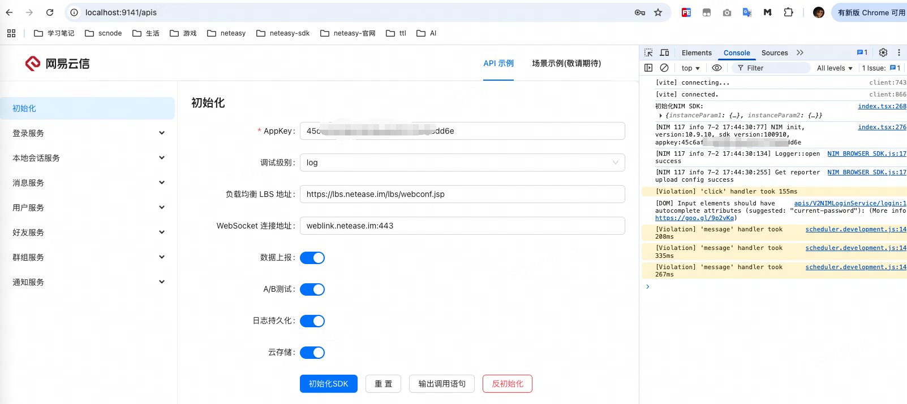
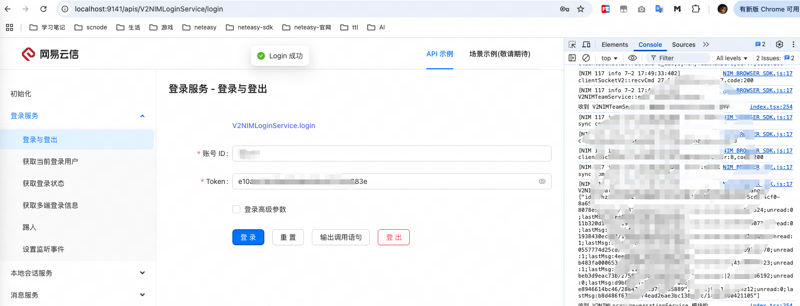
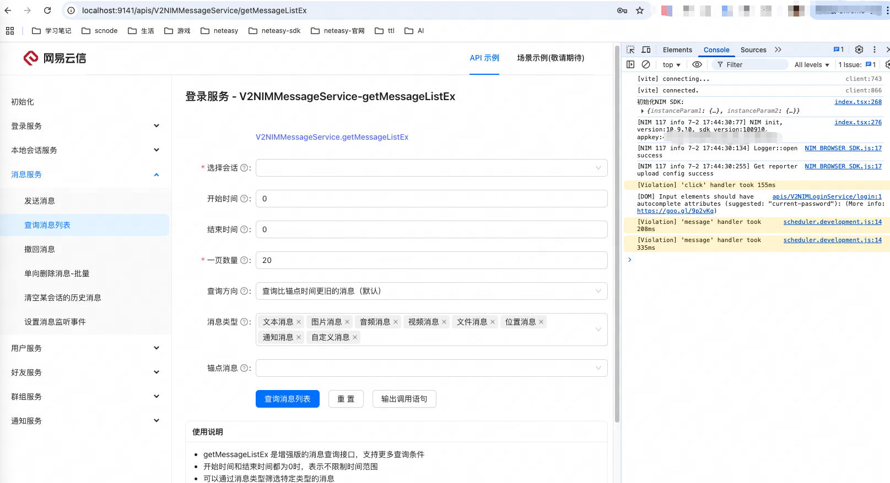
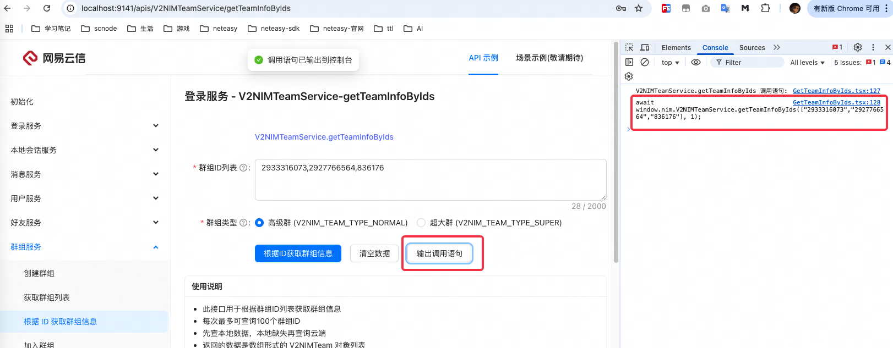

Web大白页示例代码

## 启动

前提条件, 确保您的开发环境已安装：

- Node.js（建议版本 16 或更高）
- npm 或 yarn 包管理器

安装依赖

```
npm install
```

运行

```
npm run dev
```

这将启动 Vite 开发服务器，通常会在 http://localhost:9141 或其他可用端口运行。

## 使用说明

NIM 即时通讯：提供完整的即时通讯功能测试，包括: 登录、消息、会话、用户、好友、群管理

启动后，按步骤执行以下流程

1. 初始化 SDK：首先需要在"初始化"页面配置和初始化 NIM SDK



2. 登录：完成初始化后，使用"登录"功能进行用户认证



3. 功能测试：登录成功后，就可以测试各种 NIM SDK 的功能模块



4. 复制调用语句代码



这个项目设计为开发者友好的测试工具，通过可视化界面可以快速验证 NIM Web SDK 的各项功能，无需编写复杂的测试代码。

当然对于某些复杂的流程, 开发者也可以通过路由结构找到对应的 tsx 源码阅读调用过程.

如 http://localhost:9141/apis/V2NIMTeamService/kickMember 就对应代码 src/pages/APIs/V2NIMTeamService/KickMember.tsx 中的代码

## 项目结构

API 相关的文件分布如下

```
% tree src
src
├── App.tsx  app 入口
├── components 公用组件
│   ├── APIForm 兜底 API 表单
│   ├── APILayout API 基础布局
│   ├── NIMInitForm 初始化表单
├── configs
│   ├── apiMenu.tsx  API 菜单配置
├── main.tsx  react 项目入口文件
├── pages
│   ├── APIs
│   │   ├── index.tsx  API 入口
│   │   ├── route.tsx  API 路由配置
│   │   ├── V2NIMFriendService 好友功能模块文件夹
│   │   ├── V2NIMLocalConversationService 会话功能模块文件夹
│   │   ├── V2NIMLoginService 登录功能模块文件夹
│   │   ├── V2NIMMessageService 消息功能模块文件夹
│   │   ├── V2NIMNotificationService 通知功能模块文件夹
│   │   ├── V2NIMTeamService 群功能模块文件夹
│   │   └── V2NIMUserService 用户功能模块文件夹
```

而场景示例功能, 敬请期待, 暂不介绍.
